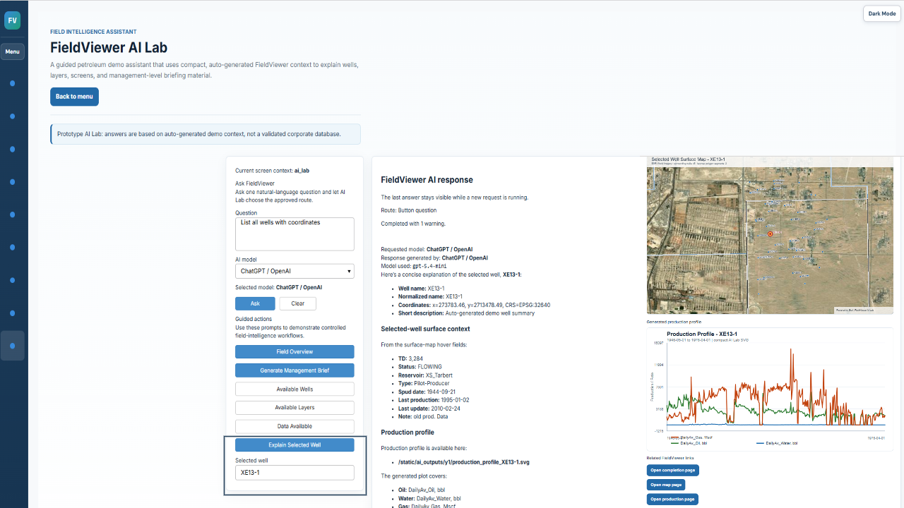
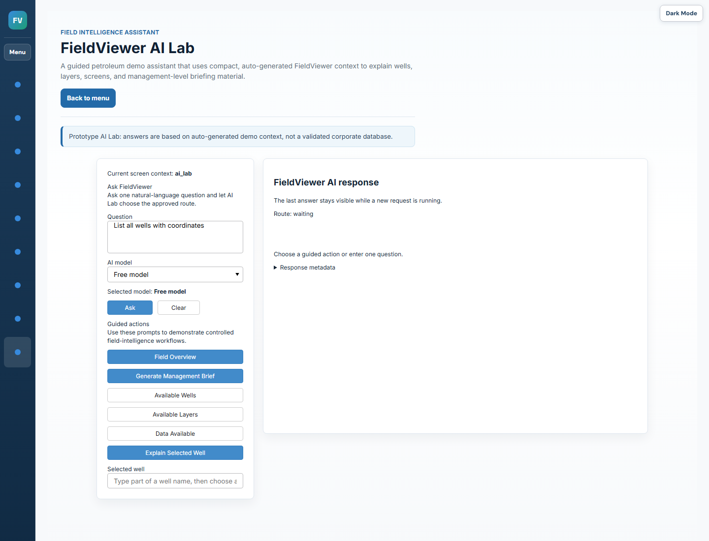
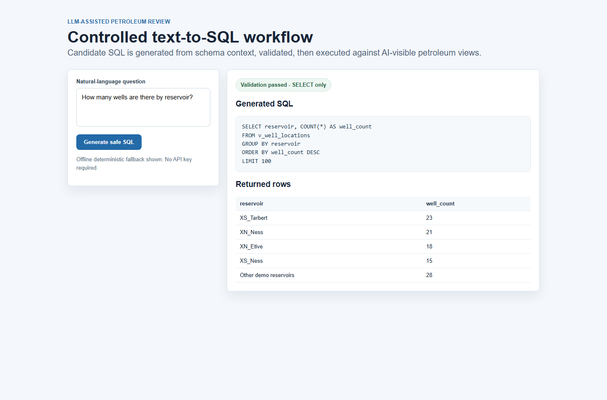

# LLM-assisted petroleum review

## text-to-SQL

Standalone demonstration of a controlled LLM-assisted petroleum data review workflow. The project extracts the AI assistance and safe text-to-SQL pattern from FieldViewer into a smaller public repository that can be reviewed, run, and extended independently.

The demo uses public Y1-style petroleum context files, builds an in-memory SQLite database, exposes only AI-visible views, validates generated SQL, and summarizes results only after validation and execution.

## What This Shows

- Natural-language petroleum questions mapped to SQL candidates.
- Compact schema context designed for LLM prompting.
- SELECT-only SQL validation before execution.
- Hidden-table protection for non-AI-visible data.
- Deterministic offline fallback so the workflow runs without API keys.
- A representative notebook that walks through the full process cell by cell.

## Screenshots

The screenshots below focus on the AI-assisted review and text-to-SQL workflow.







## Repository Structure

```text
llm_petroleum_review/
  database.py       Build the demo SQLite database and schema context.
  sql_guard.py      Validate generated SQL before execution.
  text_to_sql.py    Generate, validate, execute, and summarize answers.
data/y1_ai_context/
  *.json            Public demo context used by the notebook and module.
notebooks/
  llm_assisted_petroleum_review_text_to_sql.ipynb
screenshots/
  *.png             Explanatory screenshots copied from the Y1 demo.
```

## Quick Start

```powershell
python -m venv .venv
.\.venv\Scripts\Activate.ps1
pip install -r requirements.txt
jupyter notebook notebooks\llm_assisted_petroleum_review_text_to_sql.ipynb
```

The core module uses only the Python standard library. `pandas` is included for notebook users who want to extend the analysis tables.

## Validation Check

Run the standalone diagnostic after changing schema metadata, generated SQL patterns, or the SQL guard:

```powershell
python tools\check_demo_sql_schema.py
```

The check verifies that the compact schema context matches the actual SQLite views, deterministic SQL does not use undeclared columns, hidden/internal tables are rejected, and safe CTE queries still validate.

## Programmatic Example

```python
from llm_petroleum_review.database import build_demo_database
from llm_petroleum_review.text_to_sql import answer_question

connection = build_demo_database()
response = answer_question(connection, "How many wells are there by reservoir?")

print(response["generated_sql"])
print(response["answer"])
```

## Safety Pattern

The SQL workflow follows this sequence:

```text
User question
-> schema context
-> candidate SQL
-> SELECT-only validator
-> safe SQLite execution
-> result-only summary
```

The validator rejects:

- write/admin statements such as `INSERT`, `UPDATE`, `DELETE`, `DROP`, `ALTER`, and `PRAGMA`
- multiple statements
- dangerous keywords hidden inside SQL comments
- AI-hidden or internal tables such as `audit_log`, `wells`, `table_metadata`, and `column_metadata`
- unbounded reads by applying a default `LIMIT`

The compact schema context is built from the actual SQLite view declarations and enriched with metadata. Generated SQL should only use tables and columns declared in that context.

## API Keys

No API keys are included or required. The notebook runs with deterministic SQL generation so reviewers can inspect the architecture without network access or paid model credentials.

If an LLM provider is added later, keep credentials outside the repository in environment variables and keep the same validation boundary: the model proposes SQL text, but it never receives a database connection and never executes SQL directly.

## Data Note

The included JSON files are compact public demo context files. They are representative of a petroleum review workflow and are intentionally smaller than a full operating database.
